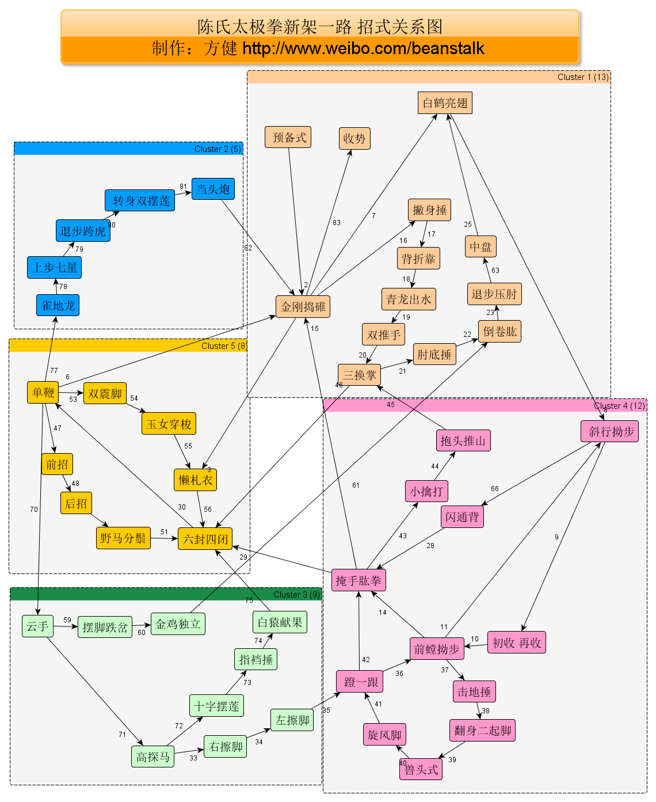

陈氏太极拳新架一路
================

1.  预备式
立身中正，左脚向左开一步，与肩同宽。气沉丹田。

2.  金刚捣碓
双手缓缓抬起，与肩同宽，双手随身体下沉落于腹前。身体微左转，左掌旋掌外旋，右掌内旋，随身运至与左肩平身体右转，右脚尖外摆，左掌内旋，右掌外旋。随身体转至与肩平左脚抬起向左前45度，左手外旋，右手内旋，左手至左前方，右手至右后方右腿上步至右前方，左手继续上领。然后双手相合于右胸前。双手随重心下沉至腹前。右膝提起与腹平，右手握拳屈肘上抬至肩高。左手掌心向上于腹前。右脚震脚落地。右拳落于左掌心。
[提，左右，左 + 捣碓]

3.  懒扎衣
身体微右转，左手外旋，右手内旋。后双手内旋运至右前方，身体左转。双掌内旋运至腹前。右拳变掌双手上抬。左手立掌于身体左侧。右手立掌于左胸前。身体左转，双掌外旋。左手划至左下方，右手划至右上方。右腿向右侧开一大步。双手交叉于体前。身体左转。左手内旋置于左腰间。右手外旋向上划弧至体右侧。

4.  六封四闭
身体右转，左手外旋，右手内旋收于腹前交叉。重心右移，双手置右上方双手向下划弧，运至体前与肩平身体右转，双手上合至两耳旁左腿收回至身体左侧双手下按于身体右侧
[裹，挤，捋，按]

5.  单鞭
身体右转，双手内旋，左掌前伸，右掌里合右掌变勾上提略高于肩身体微左转，左脚向左大开一步，重心左移左手向上划弧至左侧与肩平
[画2圆右手顺左臂画圆,左手顺右臂画圆]

6.  金刚捣碓
左手微内旋下滑右手向下划弧合左手于身体左侧身体右转，左手内旋，右手外旋，向上划弧运至身体右侧身体左转，左手外旋转， 右手内旋，双手向下划弧运至身体左侧身体右转，左手内旋，右手外旋，向上划弧运至身体右侧身体微右转，左手外旋，右手内旋，左手至左前方，右手至右后方右腿上步至右前方，左手继续上领，然后双手相合于右胸前双手随重心下沉至腹前右膝提起，右手握拳屈肘上抬至肩高。右拳落于左掌心口。
[合，左右，左右，左+捣碓]
[双手画2大圆+捣碓]

7.  白鹤亮翅
身体微右转，两手左外右内旋后，内旋至右前方，身体左转，两手内旋移至腹前两手变掌上抬身体微左转，两手外旋，左下右上划弧分开收右腿向右前45度大开一步。两手左上右下划弧交叉。身体左转，收左腿于体侧，两手外旋，左下右上划弧线拉开。右掌内旋上领，左掌外旋下沉
[旋拳,化掌,拉开,相合跨步,拉开跟脚,上顶下钻]

8.  斜行拗步
身体右转，左掌向上划弧屈臂立掌于左胸前，右掌下按于右胯旁抬左腿向左侧45度大开一步,右掌内旋上抬，再外旋至与肩平身体微右转，身体下沉。左掌外旋向下划弧于左膝上方，右掌屈臂至于右耳根重心移至左腿，左掌变勾手提至与左肩平。右掌经左臂内侧划弧线拉开。
[双内弧收手,跨步搂膝护耳,左勾手单鞭]

9.  初收
两臂上提合至体前上方，掌心向外。两掌外分向下划弧合至左膝上方重心移至右腿，左膝上提，两掌外旋，收于腹前。两掌快速经左膝上方向下发力
[发力向上,右捧水,左提腿下按]
[独立下按状]

10. 前趟拗步
两手向右下方划弧，运行至身体右侧与肩平左脚向前迈步，两掌里旋，右掌与左手交叉于体前右脚提起，向右后方45度大开一步，重心右移动，两手外旋转两臂向上划弧分至身体两侧前
[双顺圆,左交叉落脚右跨步,双外弧]
[顺圆跨步双外弧]
[蛤蟆状]

11. 斜行拗步
左掌外旋，右掌内旋，向左运行至身体左侧身体右转，收左腿并向左前方45度大开一步左掌外旋，右掌屈臂立于右耳根重心移至左腿，左掌变勾手提至与左肩平，右掌经左臂内侧划弧线拉开
[大S弧收手,右转身左跨步搂膝护耳,左勾手单鞭]
[左勾手单鞭]

12. 再收
两臂上提合至体前上方两掌外分向下划弧合至左膝上方两掌外旋，掌心向下，收于腹前,左膝上提
[发力向上,右捧水,左提腿下按]
[独立下按状]

13. 前趟拗步
两手向右下方划弧,运行至身体右侧与肩平,左脚向前迈步,右掌向上划弧与左手交叉于体前右脚提起向右后方45度大开一步身体左转,两手外旋转,两臂向上划弧分至身体两侧前

14. 掩手肱拳
两臂下沉后,两手握拳,身体右转,右膝屈膝提起,双掌合至胸前右脚震脚落,左脚向左前方45度大开一步,身体右转,左肘后振,右拳拳心向上向右横打身体左转,左掌经右侧划弧于右胸前,右拳内合于左肘外身体右转,两手变掌下于身体两侧右腿蹬地,右手握拳收于右腰间身体左转,左肘后振,右拳快速向体前冲拳
[右手上采，抬右腿，右手擦右大腿，右脚踏，抬左腿，收左手伸右拳打左边]

15. 金刚捣碓
身体右转,两拳变掌,掌心相对身体稍向右转再左转,左掌外旋向上划弧,右手内旋向下划弧两手相合交叉于体前双脚同时跳震,两臂迅速向右前发力[十字手]身体少左转,两手外旋,左下右上划弧分开重心移至右腿,左腿向左前方上一步两臂继续划弧右腿迅速向前上步,两手合至右胸前,重心下沉,两手随重心下沉至腹前右膝抬起与腹平,右手握拳衢州上抬至肩高左掌心向上于腹前右脚震脚落地右拳落于左掌心
[触电缩手,抱小球拉开,然后金刚捣碓]

16. 拔身捶
身体微右转,双手内旋运至右前方重心右移,两手移至左腹前后右腿向右开一步两手下分后上合交叉于体前同时两掌变拳从左向右交错开于体前两脚震脚,左右开步同时左拳向后横打右拳向左锤肘横打
[洪:双手反拳前打，钻左拳，钻右拳，左叉腰，右上打，右弓步]

17. 背折靠
[洪:右肘把对方裹进来,左肘再裹进来,然后双手置于档前,腕十字]

18. 青龙出水
身体右转,左拳内旋移至身体左上方右拳内旋,下压收回右腰间重心快速右移,同时左肘后振,右拳上撩至右上方身体稍右转,左拳变掌向体前撩掌发力右肘向后发力重心左移动,左手内旋与右拳相合与胸前重心迅速移至右腿左肘后振,右拳外旋向右撩拳发力
[洪:右手档前打,左手档前打，左转茶壶]

19. 双推手
[左手叉腰,右手伸开旋腕,(茶壶状),左转,双推手]

20. 三换掌
[三换掌]

21. 肘底捶
[画大弧分开,右手划拳置于左肘底]

22. 倒卷肱

23. 退步压肘
[右旋腕塌右肘,左肘裹，右肘裹，退步压肘]

24. 中盘
[双手从下逆时针捋到上,再顺时针从上捋到下,提右脚]

25. 白鹤亮翅

26. 斜行拗步 

27. 闪通背
两手上提至体前上方合掌,两手内旋下分于身体两侧身体稍右转两手内合交叉于胸前身体左转左脚向后划两掌向外发力分开,身体右转,右掌内旋向下划弧,左掌外旋向上划弧左臂划至体前与肩高,右手收于腰间左脚向前迈一步,移重心,左掌下按至左腰间,右手迅速前穿至体前身体微左转,左掌内旋,右掌外旋划弧,随身体向右侧运行右腿迅速后撤,两掌随身体转到上抡下按至体前
[捧水，左转，肘击，拳击，穿掌，转身过肩摔。]

28. 掩手肱拳
[右脚提脚踏步上前,震脚出手]

29. 六封四闭

30. 单鞭

31. 云手

32. 高探马
[两手合,开,右手按,左脚虚,身体左转]

33. 右擦脚
[双手合,左脚上步,双手交叉再从上往下右手拍右脚面]

34. 左擦脚
[双手合,左脚上步,右转身,双手交叉再从上往下左手拍右脚面]

35. 蹬一根
[左转,右手穿拳,左手收腰,左腿蹬]

36. 前趟拗步
[趟左脚,收右手,变蛤蟆]

37. 击地锤

38. 翻身二起脚
[击地弹起转身二踢脚]

39. 兽头势
[护心锤]?
[?右手护耳,双拳内翻而出,下砸上打?]

40. 旋风脚
[转身抬左脚]

41. 蹬一腿
[右蹬一根]

42. 掩手肱拳
[左拳上冲,右拳下砸(翻花舞袖),震右脚落地,抬左脚合手,双手提身体跳一下,冲拳]

43. 小擒打
[推窗望月]

44. 抱头推山 
[十字拳转身，开合开，双手前按，？双峰贯耳]

45. 三换掌
46. 六封四闭
47. 单鞭
48. 前招
49. 后招
50. 野马分鬃
51. 六封四闭
52. 单鞭
53. 双震脚
54. 玉女穿梭
55. 懒札衣
56. 六封四闭
57. 单鞭
58. 运手
59. 摆脚跌岔
60. 金鸡独立
61. 倒卷肱
62. 退步压肘
63. 中盘
64. 白鹤亮翅
65. 斜行拗步
66. 闪通背
67. 掩手肱拳
68. 六封四闭
69. 单鞭
70. 云手

71. 高探马

72. 十字摆莲
[右转身,左弓步,肘底捶,右摆腿转身,左手拍右脚,左腿独立]

73. 指裆捶
[翻花舞袖开左步,左后右前拳发力,早操式左弯腰左上拳发力,左后肘右前档拳发力]

74. 白猿献果
[左转,右拳上钻,右腿提]

75. 六封四闭
76. 单鞭

77. 雀地龙
顺时针画个圈,右弓步,左手横,右手头上

78. 上步七星
左转,右拳上步与左拳交叉,外按,化拳为掌,翻手外按

79. 退步跨虎
右转,十字手内翻上提,右脚提.双手和右脚下跺,马步,骑在老虎身上,两手下抱,健美先生式

80. 转身双摆莲
右转180,拍左脚,上左步,提右脚,拍右脚,

81. 当头炮.
跺右脚,弓箭步,双拳轰头上,收回,轰胸口
 

图编辑器：
http://www.yworks.com/products/yed/download
https://github.com/gephi/gephi
